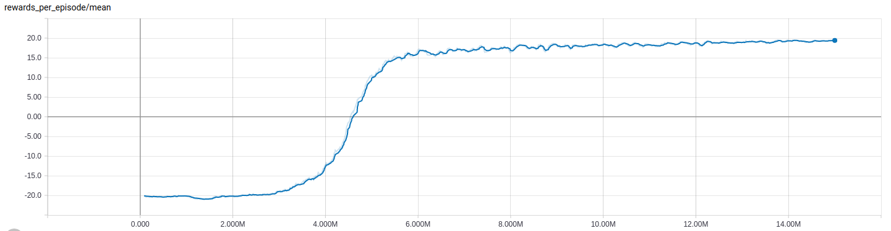

# Manette : Deep Reinforcement Learning for Atari Games
This repository contains an open source implementation of the PAAC algorithm presented in [Efficient Parallel Methods for Deep Reinforcement Learning](https://arxiv.org/abs/1705.04862) and forked from [Alfredvc's implementation](https://github.com/Alfredvc/paac). We added the possibility to use the FiGAR algorithm presented in [Fine Grained Action Repetition for Deep Reinforcement Learning](https://arxiv.org/abs/1702.06054) as well as LSTM networks, Bayesian networks, e-greedy policy and playing with colored images.

PAAC is a conceptually simple advantage actor-critic algorithm designed to run efficiently on a GPU, offering A3C like performance in under 12 hours of training. When adding FiGAR, the agent can explore more possibilities and achieve higher scores with a better motion control.


# Requirements
* Python 3.4+
* TensorFlow 1.0+
* [Arcade-Learning-Environment](https://github.com/mgbellemare/Arcade-Learning-Environment)
* cython (pip3 package)
* scikit-image (pip3 package)
* python3-tk

# Training the agent
To train an agent to play Pong, for example, run : ```python3 train.py -g pong -df logs/test_pong```.

For Pong, the agent will begin to learn after about 4 million steps, and will learn an optimal policy after about 15 million steps.



Training can be stopped (using Ctrl+c) and then resumed by running ```python3 train.py -g pong -df logs/test_pong```.

On a setup with an [Intel i7-4790k](http://ark.intel.com/products/80807/Intel-Core-i7-4790K-Processor-8M-Cache-up-to-4_40-GHz) CPU and an [Nvidia GTX 980 Ti](http://www.geforce.com/hardware/desktop-gpus/geforce-gtx-980-ti) GPU with default settings, you can expect around 3000 timesteps (global steps) per second.
Training for 80 million timesteps requires under 8 hours.

When using FiGAR or a more demanding neural network, the training can slow down to ........


## Visualizing training
1. Open a new terminal
2. Run ```tensorboard --logdir=<absolute-path>/paac/logs/test_pong```.
3. In your browser navigate to localhost:6006/


# Testing the agent
To test the performance of a trained agent run ```python3 test.py -f logs/test_pong -tc 5```.
Output:
```
Performed 5 tests for pong.
Mean: 19.70
Min: 17.00
Max: 21.00
Std: 0.97
```

## Generating gifs
Gifs can be generated from stored network weights. For example a gif of the agent playing breakout can be generated with
```
python3 test.py -f pretrained/breakout/ -gn breakout
```
This may take a few minutes.

## Pretrained models
Pretrained models for some games can be found [here](pretrained).
These models can be used as starting points for training on the same game, other games, or to generate gifs.

# Using different options and training multiple agents

If you are tired of typing multiple options in the command line to use the ```train.py``` file, you can use the ```batchTrain.py``` script in the ```script``` folder.
Simply write as many JSON files (like the one below) as you want, change all the options you wish and put them all in the same folder, say ```toTrain/batchTrain/```.

Run : ```python3 script/batchTrain -f toTrain/batchTrain```.

All your JSON files will be loaded and trained, one after the other, with the right options.

Exemple of JSON file for Pong, with LSTM network and FiGAR 10 repetitions :
```
{
  "game": "pong",
  "initial_lr": 0.0224,
  "lr_annealing_steps": 80000000,
  "max_global_steps": 80000000,
  "max_local_steps": 5,
  "gamma": 0.99,
  "alpha": 0.99,
  "entropy_regularisation_strength": 0.02,
  "arch": "LSTM",
  "emulator_workers": 8,
  "emulator_counts": 32,
  "clip_norm_type": "global",
  "clip_norm": 3.0,
  "single_life_episodes": false,
  "e": 0.1,
  "random_start": true,
  "egreedy": false,
  "epsilon": 0.05,
  "softmax_temp": 1.0,
  "annealed": false,
  "annealed_steps": 80000000,
  "keep_percentage": 0.9,
  "rgb": false,
  "max_repetition": 11,
  "nb_repetition": 10,
  "checkpoint_interval": 1000000,
  "activation": "relu",
  "alpha_leaky_relu": 0.1
}
```

Some other scripts can also simplify your life (ex. test all the agents, create many gifs, ...).
You can find them in the ```script``` folder. The ```script/README.md``` contains explanations on how to use them.


## Adapting to new neural network architectures
The codebase currently contains five neural network architectures :
* NIPS : the architecture used in [Playing Atari with Deep Reinforcement Learning](https://arxiv.org/abs/1312.5602).
* NATURE : the architecture from [Human-level control through deep reinforcement learning](https://www.nature.com/nature/journal/v518/n7540/full/nature14236.html).
* BAYESIAN : the NIPS network with a dropout layer to improve the exploration policy. See this paper about [Dropout as a Bayesian Approximation](https://arxiv.org/abs/1506.02142).
* PWYX : a bigger convolutionnal network with max pooling, inspired by [ppwwyyxx's work](https://github.com/ppwwyyxx/tensorpack/tree/master/examples/A3C-Gym).
* LSTM : the PWYX network with an LSTM cell.

To create a new architecture follow the pattern demonstrated in the other network.
Then create a new class that inherits from both the ```PolicyVNetwork``` and```YourNetwork```. For example:  ```NewArchitecturePolicyVNetwork(PolicyVNetwork, YourNetwork)```. Then use this class in ```train.py```.
